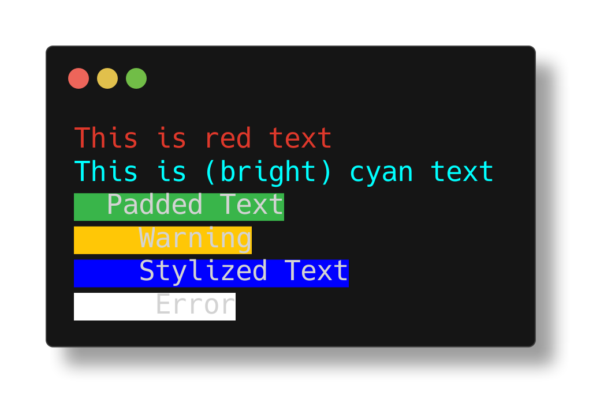

# CLI

CLI is a small framework for building CLI applications built upon Deno 2's
new standard library, [inspired](#inspiration) by similar libraries in the
Golang ecosystem. When starting new Golang projects, I find myself installing
`log` and `cli`, or writing a lot of boilerplate for standard library argument
parsing and logging. Given Deno's similarities to the Golang ecosystem, I thought
it would be fun to write my first library creating a simple, configurable
interface to build your applications.

## Installation

This package is hosted on the JSR. To install it in your project, run:

```bash
deno add jsr:@desertthunder/cli
```

## Examples

### Creating an Application

The fastest way to get started is to import the helper functions. These are
simple wrappers around the constructor for the Command class. Make note of the
Metadata type when defining the attributes and interface of your application.

```typescript
import { createApplication, createCommand, Flags } from "jsr:@desertthunder/cli";

// Define flags for your command (optional)
const flags = [
  new Flag('string', 'name', 'name of something', true),
  new Flag('string', 'type', 'type of something', true),
];

// Define an action to call when your command is run.
function exampleAction(args?: Record<string, any>) {
  if (!args) {
    console.log("No args passed!");
    return;
  }

  console.log(JSON.stringify(args, null, 2));
},

// Define metadata for your command
const exampleCommand = createCommand(
  { name: 'command', usage: 'do something' }, action, flags
)

// Create a root command
const root = createApplication(
  { name: 'application', usage: '' }, [exampleCommand]
);

// if __name__ == '__main__' ?
if (import.meta.main) {
  root.run(Deno.args);
}
```

### Logger

```typescript
function example() {
  const logger = createLogger("example-logger");

  logger.info("Example");
}

if (import.meta.main) {
  example();
}
```

### Colors

```typescript
console.log(colorizeText("This is red text", TerminalTextColor.RED));
console.log(
  colorizeText('This is (bright) cyan text', TerminalTextColor.BRIGHT_CYAN),
);

// See src/libs/logger/colors.ts for the full code block of examples.
// Run deno run src/libs/logger/colors.ts the see the examples with your
// terminal emulator's color scheme
```



## Runtime Compatibility

| Runtime | Version | Works | Notes |
| ------- | ------- | ----- | ----- |
| Deno    | 2.1.4   | ✅    |       |

## Inspiration

- Charm's [log](https://github.com/charmbracelet/log) library
- Urfave's [cli](https://github.com/urfave/cli) V2 & V3

## License

Copyright 2024 Owais J (mailto:desertthunder.dev@gmail.com). See [`LICENSE`](./LICENSE)
for more information.
